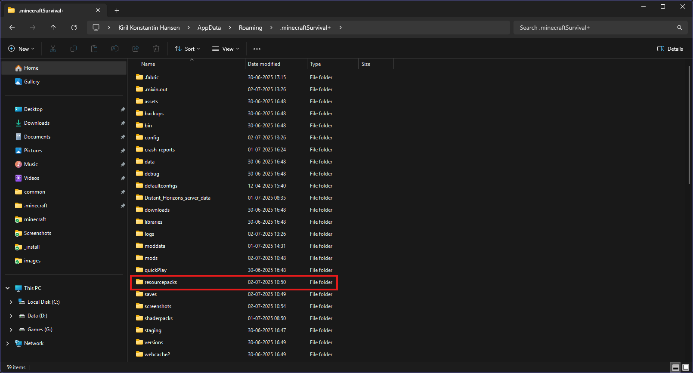

# Instruktioner #

Det her er instruktioner til downloade de nødvendige ting til serveren

Download release: _install.zip

## Installér Fabric ##

### Download Fabric ###

*Hvis du allerede har fabric installeret så kan du skippe det her*

Brug [det her link](https://fabricmc.net/)

Tryk på `Download` knappen

### Kør programmet ###

Find filen `fabric-installer-X.X.X.exe` i din download mappe

Kør den

Nu kommer der et vindue op, ændr versionen til 1.21.4

Tjek at der er et flueben ved "create profile"

**Nu har du installeret Fabric**

## Installér mods ##

### Find mappen ###

Tryk `Windows`+`R`

Der skulle gerne komme et vindue op

Skriv `%appdata%`

Tryk `Enter`

Gå ind i mappen der hedder `Roaming`

Der skulle gerne være en mappe der hedder `.minecraft`

Dupliker mappen (`Ctrl`+`C`, `Ctrl`+`V`)

Kald den nye mappe for `.minecraftSMP` eller noget i den stil

***SÅ LÆNGE AT DEN STARTER MED*** `.minecraft` ***OG AT DER IKKE ER NOGLE MELLEMRUM I***

### Sæt mods ind ###

I `_install` mappen (den mappe jeg har sendt til dig) ligger der en mappe der hedder `mods` den kalder jeg for `_install/mods`

Gå ind i din nye `.minecraftSMP` mappe og find mappen der hedder `mods` den kalder jeg for `.minecraftSMP/mods`

Slet alle filer i `.minecraftSMP/mods` mappen 

I `_install/mods` skal du markere alle filerne ved at trykke `Ctrl`+`A` og trykke `Ctrl`+`C`

Så skal du gå over til din `.minecraftSMP/mods` mappe og trykke `Ctrl`+`V`

**Nu har du installeret de mods der skal bruges**

## Installér resource packs ##

### Installér dem ###

I din `.minecraftSMP` mappe er der en mappe der hedder `resourcepacks`

Gå ind i den mappe og slet alle filer der er der inde

I `_install` mappen er der også en `resourcepacks` mappe

I `_install/resourcepacks` skal du markere alle filerne ved at trykke `Ctrl`+`A` og trykke `Ctrl`+`C`

Så skal du gå over til din `.minecraftSMP/resourcepacks` mappe og trykke `Ctrl`+`V`

**Nu har du installeret resource packs**

### Rækkefølge til at aktivere dem ###
***MEGET VIGTIGT***

Markeret i fed betyder at du ikke må tage den af

1. VanillaTweaks - QOL Pack
2. Fancy Crops - Bedre Crops
3. Seedy Saplings - Saplings til Seeds
4. ***EndPortalFramefix*** - Fixer en dårlig ting ved End Portal Frame
5. Preview_Banner_Patterns - Banner Patterns viser hvilke tegn de giver på deres texture
6. Sculk Ward Trim - Giver ward armor trim sculk effect ligesom silence armor trim
7. Serified Font - Bedre skrifttype
8. Enhanced Boss Bars - Bedre boss bars i stedet for en lige linje
9. ***Default Connected Textures*** - Til continuity (mod)
10. ***Glass Pane Culling Fix*** - Til continuity (mod)
11. ***Banner_TextRP*** Til Banner Text (mod)
12. Beta Beacon - Bedre Beacon
13. Better Gear - Bedre Armour
14. CEN - Farvet enchantment names
15. Creeper Retextured - Beder creeper texture
16. Eating Animation - Animationer når du spiser
17. Recolorful Containers\* - Bedre GUI
18. CustomConatainers\* - Fix til recolorful containers + fix til terralith - anbefalet
19. Enchanted - Xp Bar bliver til galactic alphabet
20. New Hearts - Hjerter i xp bar ser bedre ud
21. ***vanilla-glowing-ores*** - Lysende ores
22. ***Chests-Reimagined*** - Fix til kister
23. Cherry Background - Bedre baggrund (jeg har selv taget billedet)
24. Nether Wart Retexture - Bedre nether wart

\*Hvis du har `Recolorful Containers`på så skal du have `CustomConatainers` på

## Kør spillet ##

**DET HER ER MEGET VIGTIG HVIS DU IKKE GØR DET HER SÅ ER DER IKKE NOGET DER VIRKER**

Åbn `.minecraftSMP` mappen

Kopier addressen ved at trykke på adresselinjen og tryk `Ctrl`+`C`

Når du har åbnet launcheren skal du trykke på `Installations` knappen

Tjek at der er et flueben ved modded og find den installation der hedder `fabric-loader-1.21.4` click på den

Du kan ændre dens ikon og kalde den noget andet men det vigtigste er at du trykker på `browse` knappen ved `GAME DIRECTORY`

Tryk på adresselinjen og tryk `Ctrl`+`V` og tryk `ENTER`

Gå tilbage til `Play` siden og tryk `PLAY`

**Hvis du skal spille en anden modded 1.21.4 så gør det samme som før men hvor du ændre mappen `GAME DIRECTORY` tilbage til den originale `.minecraft` mappe, så skal du bare huske at ændre mappen tilbage når du skal spille på serveren ellers kan du ikke joine**

Gå ud af spillet når du har startet det

## Installér shaders ##

### Vælg shaders ###

Du kan vælge shaders [her](https://modrinth.com/shaders?v=1.21.4&g=categories:iris) men jeg vil anbefale `Complementary Shaders - Reimagined`

I `_install` mappen er der en mappe der hedder `shaders` i den mappe kan du finde `Complementary Shaders - Reimagined`, du kan også vælge at lade være med at spille med shaders.

### Installér shaders ###

Hvis du gerne vil spille med shaders så skal du finde din shader `.zip` og flytte den til `shaderpacks` mappen der er inde i `.minecraftSMP` mappen

## Config ##

**Det her er vigtigt**
### Mods ###

**Jade**

*Hvis du har enhanced boss bars på*

Mod Settings/General - Boss Bar Overlap: Hide Tooltip

**Liste over GUI mods som du kan indstille**

- Appleskin - Saturation viewer
- Better Advancements - Bedre detaljer over advancements
- Chat Heads - Skin hoved ved siden af navn i chat (Hoved-Navn-Besked)
- EXP Counter - Viser xp i alt (enkelt score) viser xp score til næste level og totale level
- GUI Clock - Et ur men som er på skærmen
- REI (Reoughly Enough Items) - En kæmpe menu over alle recipes
- Shulker Box Tooltip - Viser indhold af ting i shulkerbox
- Simple HUD Enchanced - En masse hud enhancements
- Xaero's World Map - Minimap
- Xaero's Minimap - World map

Jeg råder dig til at kigge hvert af de her mods config igennem.

Når du kommer ind i spillet så tryk på `mods`

Når du har musen ind over et mod så kommer der et lille `settings` ikon over billedet til moddet tryk på det for at indstille moddet

## Settings ##

**Det her er vigtigt**

### Controls ###

**Controls/Key Binds**

**Liste over hver eneste kontrol der er nødvendige**

Movement
- Alle
  
Gameplay
- Alle

Inventory
- Alle

Creative Mode
- Ingen

Multiplayer
- Alle

Miscellaneous
- Ingen

WI Zoom
- Zoom
  
Camera Enchancements
- Toggle Freelook

Chunkloaders
- View Chunkloaders

Horse Buff
- Open Inventory on Horse (Det gør at du kan åbne din rigtige inventory i stedet for heste inventory)

Jade
- Ingen

OptiGUI
- Ingen

Simple HUD Enhanced
- Ingen

Voice Chat
- Push to Talk
- Voice Chat Menu

Xaero's Minimap
- Enlarge Minimap

Xaero's World Map
- Open World Map

Iris
- Ingen

### Shaders ###

**Video Settings/Shader Packs (Oppe i højre hjørne)**

**Anbefalede indstillinger til complementary - reimagined:**

Atmosphere
- Aurora Borealis: Set by Style
- Night Nebulae: Off
- Night Star Amount: Medium
- Aurora C.: Full Moon in Snowy Biome
- Rainbows: After Rain
- Clouds
- - Cloud Style: Vanilla
- - Cloud Altitude: 800
- - Prevent Clouds in Interiors: On
- - Cloud Speed: Synced to World Time
- - Cloud Shadows: Off
 

### Voice Chat ###

[Brug den her guide](https://modrepo.de/minecraft/voicechat/wiki/client_setup)

## Vigtigt ##

Kig på [den her liste](https://modrinth.com/collection/MRYq9g8U) og find ud af hvilke mods der er på, det kommer til at hjælpe dig og mig for så skal jeg ikke forklare hvilke mods der er på
